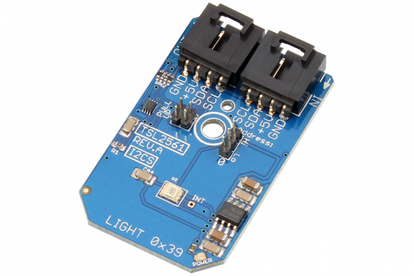

# TSL2561

Manufactured by AMS-TAOS USA Inc., the TSL2561 is a light-to-digital converter that transforms light intensity to a digital signal output with an integrated I2C interface.The TSL2561 is designed for display panels (LCD, OLED, etc.) with the purpose of extending battery life and providing optimum viewing in diverse lighting conditions.
This Device is available from www.ncd.io 

[SKU: TSL2561_I2CS]

(https://store.ncd.io/product/tsl2561-light-to-digital-converter-16-bit-programmable-gain-i2c-mini-module/)
This Sample code can be used with Arduino.

Hardware needed to interface TSL2561 sensor with Arduino

1. <a href="https://store.ncd.io/product/i2c-shield-for-arduino-nano/">Arduino Nano</a>

2. <a href="https://store.ncd.io/product/i2c-shield-for-arduino-micro-with-i2c-expansion-port/">Arduino Micro</a>

3. <a href="https://store.ncd.io/product/i2c-shield-for-arduino-uno/">Arduino uno</a>

4. <a href="https://store.ncd.io/product/dual-i2c-shield-for-arduino-due-with-modular-communications-interface/">Arduino Due</a>

5. <a href="https://store.ncd.io/product/tsl2561-light-to-digital-converter-16-bit-programmable-gain-i2c-mini-module/">TSL2561 Light To Digital Converter Sensor</a>

6. <a href="https://store.ncd.io/product/i%C2%B2c-cable/">I2C Cable</a>

TSL2561:

Manufactured by AMS-TAOS USA Inc., the TSL2561 is a light-to-digital converter that transforms light intensity to a digital signal output with an integrated I2C interface.The TSL2561 is designed for display panels (LCD, OLED, etc.) with the purpose of extending battery life and providing optimum viewing in diverse lighting conditions.

Applications:

• Street light control

• Security lighting

• Sunlight harvesting

• Machine vision

• Automotive instrumentation clusters.

How to Use the TSL2561 Arduino Library

The TSL2561 has a number of settings, which can be configured based on user requirements.
          
1.Gain setting:The following command is used to set the gain of sensor.

              tsl.setGain(GAIN_16X);                                  // 16X
            
2.Integration time setting:The following command is used to set the integration time.

             tsl.setIntegTime(INTEGRATIONTIME_13_7MS);               // 13.7 ms
